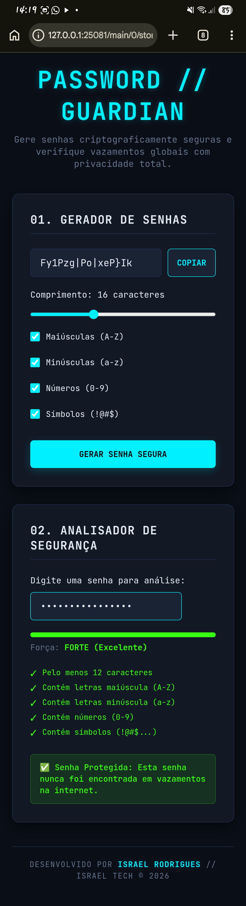

# 🛡️ Password Guardian // Israel Tech

🔗 **Acesse a aplicação em produção:** [passwordguardians.netlify.app](https://passwordguardians.netlify.app/)

Uma aplicação web moderna (estilo Dark/Cyberpunk Tech) desenvolvida para sanar uma das maiores vulnerabilidades atuais: a reutilização de credenciais fracas.

## 🔴 O Problema
Bilhões de contas são invadidas anualmente devido ao uso de senhas previsíveis ou que já foram vazadas em vazamentos de dados passados (Data Breaches). O usuário comum não sabe medir a força real de sua credencial e muito menos se ela já está circulando em fóruns cibercriminosos.

## 🟢 A Solução (O Produto)
O **Password Guardian** atua em duas frentes com foco absoluto em usabilidade e segurança de nível militar:
1. **Gerador Estatístico:** Cria senhas complexas utilizando a Web Crypto API (`window.crypto.getRandomValues`), garantindo aleatoriedade real de entropia (CS-PRNG), ao contrário do previsível `Math.random()`.
2. **Analisador de Segurança Real-Time:** Mede a força da senha e os requisitos enquanto o usuário digita.
3. **Módulo Antivazamento com K-Anônimato:** Consulta de forma assíncrona a API do *Have I Been Pwned* aplicando a técnica de **K-Anonymity**. O sistema gera o hash SHA-1 da senha e envia apenas os 5 primeiros caracteres para a API. A validação do sufixo final ocorre localmente no browser do usuário, garantindo que a senha **nunca trafegue pela internet**.
4. **Otimização por Debounce:** As requisições à API possuem um delay inteligente de 500ms pós-digitação para mitigar gargalos de rede e requisições desnecessárias.

## 🛠️ Tecnologias Utilizadas
* HTML5 (Estrutura semântica)
* CSS3 (Layout Responsivo Grid/Flexbox e Neon Tech Aesthetic)
* JavaScript Vanilla (Web Crypto API, Async/Await Fetch, Bitwise Operations)

---
Desenvolvido por **Israel Rodrigues** // Israel Tech © 2026
